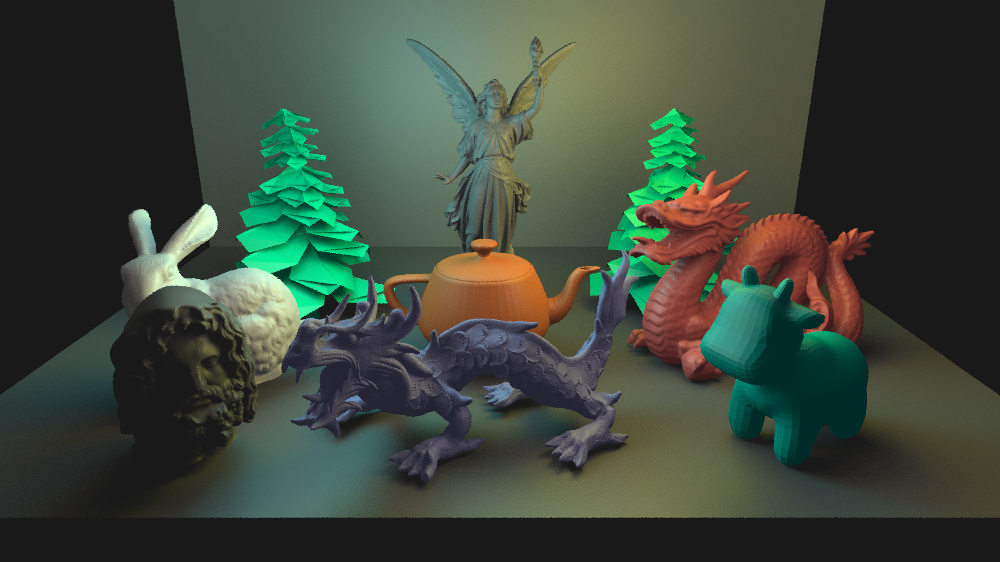

# Rendering-Lab

This is a ray tracer implemented as part of the rendering lab project at the University of Freiburg. The report of the work done can be found <a href="Report/Adil_Rabbani_Lab_Report.pdf">here</a>. The ray tracer was tested on a machine with Ubuntu 20.04.2 LTS. In order to run the code, run this command in the root directory:

```
g++ -o output main.cpp
```
and then run the output file as
```
./output
```
This will start rendering a scene `(benchmark_scene_1)` from `demoscenes/demoscenes.h` and the rendered image is saved in ţhe folder `renders`, after the rendering is complete. Note that you need to be able to open `ppm` format images. The image below was converted to `png` to support markdown but the same image is rendered with a `ppm` format and saved in the folder.



There are many other scenes to test in `demoscenes/demoscenes.h`. You can render your own scenes by making changes to any of the `demoscenes` or by creating your own. The `demoscenes.h` file again is helpful to get an idea how to create your own scene.

There are some other constants that can be set in the file `constants.h`. Set `USE_UNIFORM_GRIDS = true` if you want to use compact grid. Likewise, set `BVH_CENTROID_SPLIT = true` and `USE_BVH = true` if you want to use BVH. Remember to set the other structure to `false` if using another structure. So, set `USE_UNIFORM_GRIDS = false` if using BVH and vice versa. By default, `USE_UNIFORM_GRIDS = true` and `USE_BVH = false`. Note, that there is an SAH split implementation in `bvh.h` but it was not possible to complete it in the given time so it is commented out.

There is one small issue when using BVH. You may notice noise for coplanar triangles if they are quite large. This happens very occasionally but might be visible for some cases. It can be fixed by adding a small epsilon value (`0.00001`) to make the triangle non-coplanar. This is being done for some demo scenes. Unfortunately, the bug itself was not possible to fix in the given time.

One thing to remember is the arguments passed to scene object. If nothing is passed, the scene renders with ambient, diffuse as well as specular material properties and AABBs are used. The arguments can be passed as:
```
Scene scene()

Scene scene(1, 1, 1, 1) // ambient, diffuse, specular, aabb, in that order

Scene scene(1, 1, 1, 1, color(0, 0, 0)) // this extra argument will change the background color to black or any other color of user's choice

Scene scene(1, 1, 1, 1, texture("textures/stars.ppm")) // this extra argument will change the background to a texture
```

The external libraries are saved in the folder `libraries` and some parts taken from [Ray Tracing in One Weekend](https://raytracing.github.io/books/RayTracingInOneWeekend.html) in the folder `RTIOW`. `aabb.h` is also placed in `Scratchapixel` as I'm using the same implementation explained there. There are some other places which are quite similar to how they were explained in [Ray Tracing in One Weekend](https://raytracing.github.io/books/RayTracingInOneWeekend.html) but it's rather difficult to separate everything as I also did a lot of changes.

## Thanks to
1. [Ray Tracing in One Weekend](https://raytracing.github.io/books/RayTracingInOneWeekend.html)
1. [Scratchapixel](https://www.scratchapixel.com/) for properly explaining all the concepts and the [AABB](https://www.scratchapixel.com/lessons/3d-basic-rendering/minimal-ray-tracer-rendering-simple-shapes/ray-box-intersection) implementation.
1. [Inigo Quilez](https://www.iquilezles.org/www/articles/intersectors/intersectors.htm) for the ray-triangle intersection method.
1. [Chris Gyurgyik](https://github.com/cgyurgyik/fast-voxel-traversal-algorithm/blob/master/overview/FastVoxelTraversalOverview.md) for the nice explanation of Fast Voxel Traversal Algorithm.
1. The grass texture in `textures` was taken from https://3djungle.net/textures/grass/1417/.
1. The other solar textures were taken from https://www.solarsystemscope.com/textures/.
1. The `cube` model was taken from https://people.sc.fsu.edu/~jburkardt/data/obj/obj.html.
1. The blender suzanne model was taken from https://github.com/OpenGLInsights/OpenGLInsightsCode/blob/master/Chapter%2026%20Indexing%20Multiple%20Vertex%20Arrays/article/suzanne.obj
1. The Stanford dragon, Serapis Bust, Srub Pine Tree, Utah Teapot and Happy Buddha were taken from https://casual-effects.com/data/
1. The Stanford XYZ dragon, Stanford bunny, Stanford Lucy and Caltech Spot were taken from https://github.com/alecjacobson/common-3d-test-models
1. The grass model was taken from https://free3d.com/3d-model/high-quality-grass-78178.html
1. PNM image library: https://github.com/ToruNiina/pnm/blob/master/pnm.hpp
1. TinyObjLoader: https://github.com/tinyobjloader/tinyobjloader

